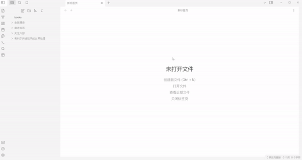

# Epub Importer

Import .epub file into your [Obsidian vault](https://obsidian.md/) as markdown notes. For more information, there are some text: [obsidian-epub-importer/wiki](https://github.com/aoout/obsidian-epub-importer/wiki). And there is a example vault: [mdReader](https://github.com/aoout/mdReader).

## Usage

Run `Epub Importer: Import epub to your vault` command, and input the absolute path to .epub file you want to import it into your obsidian vault.

Then, the .epub file will be converted to a folder and some notes, 
so you can read the book directly in obsidian, and make some marks, make some links and notes.



Or, you can add some `libraries`` in settings, and epubs under the paths will come out when you type the command.

### Propertys template

all available variables:

```
- {{bookName}}
- {{title}}
- {{author}}
- {{publisher}}
- {{language}}
```

example:

```
title: {{bookName}}
author: {{author}}
publisher: {{publisher}}
status: false
```

### AssetsPath template

all available variables:

```
- {{savePath}}
- {{bookName}}
```

example:

```
{{savePath}}/{{bookName}}/images
```
# Helpful for Workflow

## [obsidian-custom-sort](https://github.com/SebastianMC/obsidian-custom-sort)

This plug-in has powerful sorting capabilities and can keep our file explorer in order. If you want to know more information, you can see [wiki/How-to-sort-files](https://github.com/aoout/obsidian-epub-importer/wiki/How-to-sort-files%3F) and [Example Vault](https://github.com/aoout/mdReader).

## [obsidian-remember-cursor-position](https://github.com/dy-sh/obsidian-remember-cursor-position)

This plugin can record the position of the cursor and restore it when opening the same file again. However, unfortunately, what we want most is to record the position of the editor scroll.

## How do you use epub importer

Please share your usage and experience, feel free to write someting in [obsidian-epub-importer/discussions](https://github.com/aoout/obsidian-epub-importer/discussions).

# Platform

The function is tested based on **Windows** system, so I'm not sure that the bugs on **linux** and **mac** will be fixed. If you are using **Linux** or **Mac**, _please use the corresponding tag on your issue to prompt me when creating an issue_.

Mobile support is not possible as I cannot unzip the .epub file due to limitations.

# How to issue bugs

You should also upload the .epub file the same time when the bug occurred. If you have some trouble uploading files, you can send them directly to my email: wuz66280@gmail.com.

I'm not going to implement every feature request, and if I don't think it fits my philosophy, then maybe I won't do it.
